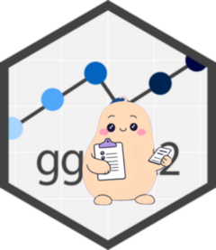

<!-- README.md is generated from README.Rmd. Please edit that file -->

```{r, include = FALSE}
knitr::opts_chunk$set(
  collapse = TRUE,
  comment = "#>",
  fig.path = "man/figures/README-",
  out.width = "100%"
)
```

# ggpal2 

<!-- badges: start -->
<!-- badges: end -->

The purpose of {ggpal2} is to have an LLM assistant specifically for ggplot2. This is an extension of the {chores} library which uses {ellmer}. This way you can specify which LLM you would like to use for this task. 

ggpal2 currently has one pal called "ggplot2". The {chores} is a **replacement** assistant, meaning you highlight code or text and the pal should be able to replace with a ggplot2. 

ggpal2 is currently prompt engineered to help with three different methods:     

 - highlighting a **non-ggplot2 plot**, replacing with ggplot2    
 - highlighting a **chunk of text explaining a plot**, replacing with ggplot2    
 - highlighting a **ggplot2, which will edit in-place, cleaning syntax and recommending color-blind friendly colors**   


## Installation

You can install the development version of ggpal2 like so:

``` r
devtools::install_github("frankiethull/ggpal2")
```

### local LLM

If interested in using a local LLM, set up your .Rprofile (`usethis::edit_r_profile()`) with the following snippet & restart your session:

```r
options(
  .chores_chat = ellmer::chat_ollama(model = "phi4:latest")
)
```

where "phi4" is a model that can be pulled for use with locally installed ollama.

### cloud LLM

If interested in using a cloud hosted LLM, set up your .Rprofile with a cloud hosted chat_* snippet, `usethis::edit_r_environ()` to set the API key, `GEMINI_API_KEY="my_api_key"` in this case, then restart your session:

```r
options(
  .chores_chat = ellmer::chat_google_gemini(model = "gemini-2.5-flash")
)
```

Finally, run the ggplot2 chore with `Ctrl+Alt+C`
